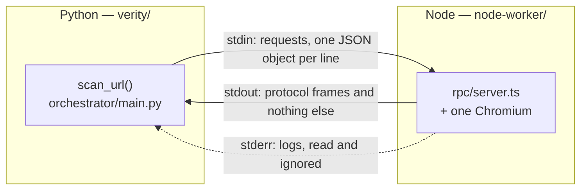
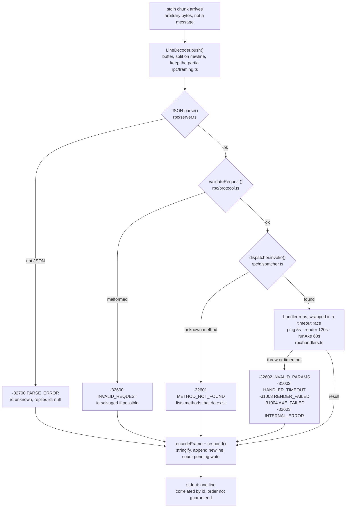
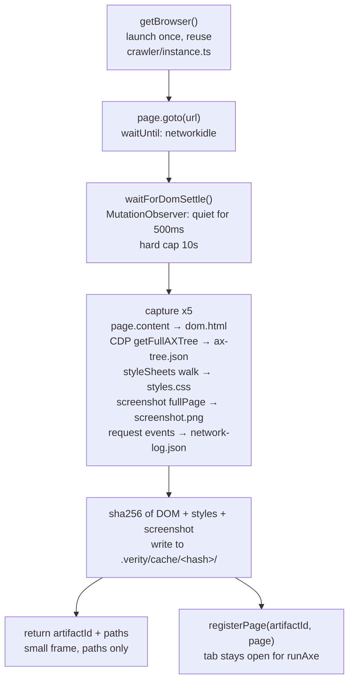
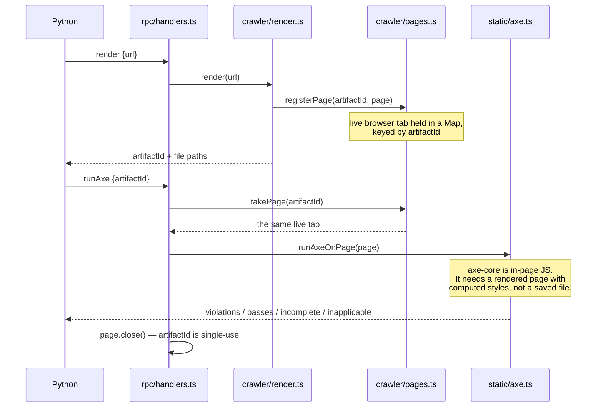

# node-worker — how a request flows

Every file in this directory, placed on the path a single message takes:
raw bytes on stdin → a JSON-RPC frame on stdout.

Read it with the code open. Each stage names its file.

- Design rationale (why stdio, why newline framing, the bugs this
  shape avoids): [`A1.1-explained.md`](A1.1-explained.md) and
  [ADR-0001](../docs/adr/0001-polyglot-json-rpc-over-stdio.md)
- Schedule and task ids: [`docs/execution-plan.md`](../docs/execution-plan.md)

---

## 1 · Two processes, three pipes

Python starts the worker as a **subprocess**, not a server. No port, no
network, no auth — and the browser launches once instead of once per page.



**stdout is the protocol channel.** Python parses every stdout line as
JSON, so one stray `console.log` — yours or a dependency's —
desynchronises the stream and surfaces as a baffling parse error
somewhere unrelated. [`rpc/log.ts`](rpc/log.ts) overwrites the global
`console` methods at startup, so the mistake is structurally impossible
rather than merely discouraged.

## 2 · Where everything lives

| File | Job | Touch it when… |
|---|---|---|
| [`rpc/protocol.ts`](rpc/protocol.ts) | Wire types, error codes, request validation | The contract with Python changes |
| [`rpc/framing.ts`](rpc/framing.ts) | Bytes → complete messages | Almost never — think hard first |
| [`rpc/dispatcher.ts`](rpc/dispatcher.ts) | Method registry, per-call timeouts, error containment | Adding a timeout or failure mode |
| [`rpc/log.ts`](rpc/log.ts) | stderr logging; guards stdout | Adding a log level |
| [`rpc/server.ts`](rpc/server.ts) | The event loop wiring it together | Changing startup or shutdown |
| [`rpc/handlers.ts`](rpc/handlers.ts) | `ping`, `render`, `runAxe` | Adding an RPC method |
| [`crawler/instance.ts`](crawler/instance.ts) | One Chromium, launched lazily, reused | Browser launch flags |
| [`crawler/render.ts`](crawler/render.ts) | Navigate, settle, capture the artifact | Capturing something new |
| [`crawler/pages.ts`](crawler/pages.ts) | Holds the live page between render and runAxe | Changing the handoff |
| [`static/axe.ts`](static/axe.ts) | Inject axe-core, bucket the results | axe options or result shape |
| [`interaction/`](interaction/) | Keyboard vs APG contracts | Week 4 — empty today |
| [`state_explorer/`](state_explorer/) | Bounded modal / menu states | Week 17 — empty today |

## 3 · The path of one request

Every stage fails in exactly one way, and every failure produces **a
reply** — never silence.



**A hang is worse than a failure.** If a handler throws and nothing goes
back, Python awaits a future that never settles and the symptom appears
minutes later with no stack trace. So `dispatcher.invoke()` never throws
— it resolves to a result *or* a structured error body, and per-method
timeouts stop one hung page wedging the whole worker.

**Why framing is the file to understand.** stdin is a byte stream, not a
message stream. One `data` event may carry half a request, exactly one,
or three and a fragment. `JSON.parse(chunk)` works on your laptop for
weeks, then breaks the first time `render` returns a real payload.

## 4 · A worked example

The three calls a real audit makes. Run it yourself:
`python3 contract/reference_client.py`

**① Handshake**

```jsonc
→ {"jsonrpc":"2.0","id":1,"method":"ping","params":{}}
← {"jsonrpc":"2.0","id":1,"result":{
     "pong": true,
     "protocolVersion": 1,        // assert at startup, not on first use
     "workerVersion": "0.1.0", "node": "v25.5.0", "pid": 4934
   }}
```

**② Render**

```jsonc
→ {"jsonrpc":"2.0","id":2,"method":"render","params":{"url":"https://example.com"}}
← {"jsonrpc":"2.0","id":2,"result":{
     "artifactId": "35abb913-…",              // handle for the live tab
     "page_state": {
       "url": "https://example.com/",
       "content_hash": "6dc36e36…",           // sha256(DOM + styles + screenshot)
       "viewport": [1280, 800]
     },
     "dom_path":         ".verity/cache/6dc36e36…/dom.html",
     "ax_tree_path":     ".verity/cache/6dc36e36…/ax-tree.json",
     "styles_path":      ".verity/cache/6dc36e36…/styles.css",
     "screenshot_full":  ".verity/cache/6dc36e36…/screenshot.png",
     "network_log_path": ".verity/cache/6dc36e36…/network-log.json"
   }}
```

Paths cross the wire, never contents. A DOM dump is hundreds of
kilobytes; putting it in a frame is exactly the payload size that
exposed the truncated-write bug described in `A1.1-explained.md`.

Field names are snake_case on purpose — they mirror
`verity.models.schemas.RenderArtifact` field for field. That Pydantic
model is the single source of truth for the shape.

**③ runAxe against that same page**

```jsonc
→ {"jsonrpc":"2.0","id":3,"method":"runAxe","params":{"artifactId":"35abb913-…"}}
← {"jsonrpc":"2.0","id":3,"result":{
     "violations": [{
       "id": "color-contrast",
       "impact": "serious",
       "selector": "#low-contrast-text",
       "tags": ["cat.color","wcag2aa","wcag143","ACT"],
       "failureSummary": "…contrast of 1.6 (fg #cccccc, bg #ffffff)…
                          Expected contrast ratio of 4.5:1"
     }],
     "passes": [...], "incomplete": [...], "inapplicable": [...]
   }}
```

**`incomplete` is the goldmine.** axe emits it when it *cannot be sure* —
text over a background image, for instance. That is its
zero-false-positive escape hatch, and adjudicating those cases
deterministically is Verity's whole wedge. Don't flatten the four
buckets into one list.

> **Note on tags.** Only `wcag<digits>` tags name a success criterion
> (`wcag143` → SC 1.4.3). `wcag2aa` is a *level* tag, and rules tagged
> `best-practice` map to no criterion at all. The Python side must not
> attribute those to a criterion — doing so produces an authoritative
> false positive. See `verity/orchestrator/main.py::extract_sc_id`.

## 5 · Inside render()



**Network idle is not "done".** A single-page app finishes its last
request and *then* renders, so capturing on idle alone gets you a
loading spinner. The observer waits for mutations to actually stop, with
a cap so a carousel or polling widget can't stall the audit forever.
Regression-tested in [`test/render-axe.test.mjs`](test/render-axe.test.mjs)
against a fixture that mutates for ~1.5s then settles.

**The cache key covers DOM + styles + screenshot** — a page can be
byte-identical in markup while rendering differently (a stylesheet
changed, an image swapped), and those are exactly the changes a contrast
pass must not skip. The network log is excluded: request timing varies
per run and would defeat caching entirely.

## 6 · Why the tab stays open



Calling `runAxe` twice on one `artifactId` is a caller error, not a
retryable one — the second call gets `-31004 AXE_FAILED` with "no live
page". Re-render if you need to re-analyse.

At shutdown `closeAllPages()` sweeps any tab whose `runAxe` never
arrived, so a crashed audit can't leave orphaned Chromium processes
behind. That runs on `SIGTERM`, `SIGINT`, stdin close, *and* the
`uncaughtException` / `unhandledRejection` paths.

## 7 · Error codes

| Code | Name | Raised when |
|---|---|---|
| -32700 | `PARSE_ERROR` | The line wasn't valid JSON |
| -32600 | `INVALID_REQUEST` | Valid JSON, not a valid request object |
| -32601 | `METHOD_NOT_FOUND` | No such method — response lists the real ones |
| -32602 | `INVALID_PARAMS` | Method exists, params are wrong |
| -32603 | `INTERNAL_ERROR` | Handler threw unexpectedly |
| -31001 | `NOT_IMPLEMENTED` | Declared but not built yet |
| -31002 | `HANDLER_TIMEOUT` | Handler exceeded its budget |
| -31003 | `RENDER_FAILED` | Navigation or capture failed |
| -31004 | `AXE_FAILED` | axe injection failed, or no live page for that id |

`-31001` exists separately from `-32601` on purpose: if an unbuilt method
simply didn't exist, the caller couldn't tell "you typo'd the name" from
"it isn't built yet" — two very different debugging paths.

## 8 · Poke at it yourself

```bash
# one-time
cd node-worker && npm install && npx playwright install chromium

# build + all 19 tests (15 protocol, 4 browser)
npm test

# talk to it by hand — stderr shows the log line, stdout the frame
npm run build
echo '{"jsonrpc":"2.0","id":1,"method":"ping"}' | node dist/rpc/server.js

# the full render → runAxe walkthrough, printed
python3 contract/reference_client.py

# verbose worker logs (stderr only — stdout stays clean)
VERITY_LOG_LEVEL=debug node dist/rpc/server.js
```

**Debugging rule:** never `console.log` to diagnose the worker — it's
redirected, and if the guard were ever removed it would corrupt the
stream. Use `log.debug()` from [`rpc/log.ts`](rpc/log.ts), which is on
stderr where it belongs.
